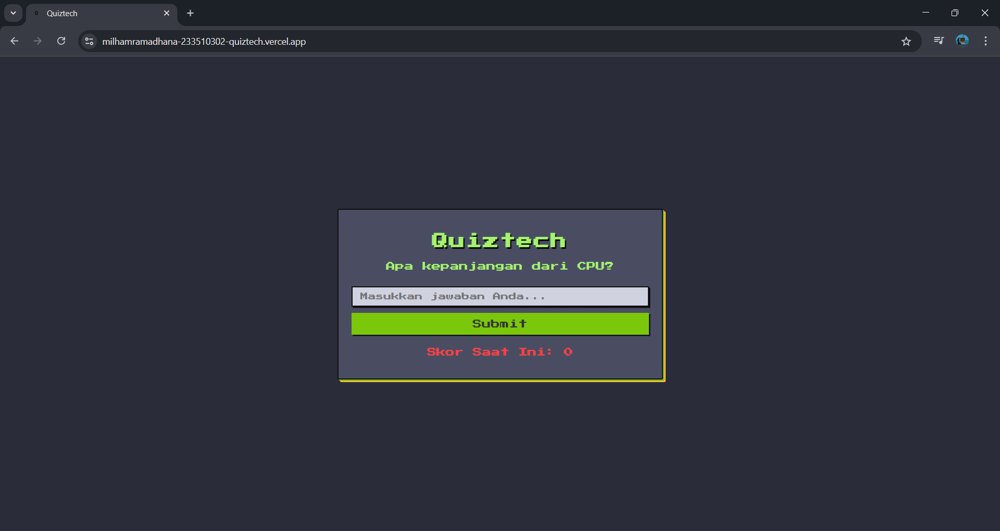

# 🎮 Quiztech - Kuis Pengetahuan Komputer



**Quiztech** adalah aplikasi kuis interaktif sederhana yang menguji pengetahuan dasar kamu tentang komputer. Dibuat dengan **Vue.js**, aplikasi ini menawarkan antarmuka bergaya **pixel-art** yang retro dan menyenangkan.

---

## ✨ Fitur Utama

- ✅ **Pertanyaan Interaktif**  
  Jawab pertanyaan satu per satu dan dapatkan umpan balik instan.

- 🧠 **Sistem Penilaian**  
  Dapatkan poin untuk jawaban benar dan pengurangan poin untuk jawaban salah.

- 🎨 **Desain Pixel-Art**  
  Nikmati tampilan visual yang terinspirasi dari game retro dengan gaya pixel yang unik.

- 📱 **Responsif**  
  Tampilan yang disesuaikan untuk berbagai ukuran layar — cocok untuk desktop dan mobile.

- 🔁 **Main Lagi**  
  Setelah kuis selesai, kamu bisa langsung mencoba lagi untuk meningkatkan skor!

---

## 🚀 Cara Menjalankan Aplikasi

Ikuti langkah-langkah mudah berikut untuk menjalankan Quiztech di lingkungan lokal kamu:

### ⚙️ Prasyarat

Pastikan kamu sudah menginstal:

- [Node.js](https://nodejs.org/)  
- npm (terinstal otomatis dengan Node.js)  
- Atau gunakan [Yarn](https://yarnpkg.com/) sebagai alternatif

### 🧾 Instalasi dan Kompilasi

1. **Clone repositori ini:**

```bash
git clone [URL_REPOSITORI]
cd [nama-folder-proyek]

2. **Instal dependensi proyek:**

```bash
npm install
atau dengan yarn:
yarn install

3. **Jalankan aplikasi dalam mode pengembangan:**

```bash
npm run dev
atau jika dengan yarn:
yarn dev

### 🛠️ Teknologi yang Digunakan
- Vue.js 3 – Framework JavaScript progresif untuk membangun antarmuka pengguna.
- HTML & CSS – Struktur dan gaya dasar aplikasi.
- Google Fonts – 'Press Start 2P' – Font khusus untuk efek pixelated.

### 👤 Kontributor
Proyek ini dikembangkan oleh:

M. ILHAM RAMADHANA
[🔗 IG](https://www.instagram.com/iphamslife?igsh=b2xtZXljY2IyemQ1)